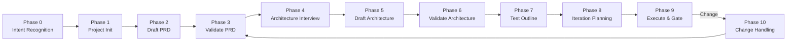

[English](README.md) | [中文](README.zh-CN.md)

# Product Lifecycle

[](LICENSE)
[](https://www.python.org/)
[](https://github.com/wxin9/cc-skill-product-lifecycle/releases)

> AI-collaborative product lifecycle management skill for Claude Code — from PRD to delivery, script-enforced phase gates + 4-layer artifact validation.

## Why Product Lifecycle?

When managing a product lifecycle manually, you may encounter these problems:

- **Scattered documentation**: PRD in Wiki, architecture in Confluence, tests in Excel — versions don't match
- **Process relies on self-discipline**: No enforced gates, skip validation and code directly, huge rework cost later
- **Broken change cascade**: Changed PRD but forgot to update test cases, only discover requirements changed when tests fail
- **Guesstimated effort**: Pull effort estimates out of thin air every iteration, no warning when project runs late
- **No architecture decision records**: Three months later, no one remembers why MongoDB was chosen

Product Lifecycle solves these with **script-enforced gates** (`sys.exit(1)` physical blocking): each phase writes checkpoint files, subsequent phases verify prerequisites, cannot skip steps. All changes (PRD/code/tests) trigger full-chain cascade updates, ensuring artifacts stay consistent.

## Key Features

- **AI-Collaborative Drafting**: Claude actively drafts PRD and architecture documents, you be the reviewer, say goodbye to blank template paralysis
- **Compound Intent Recognition**: "Fixed a bug and want to adjust requirements" — both intents recognized simultaneously, prioritized, and executed step-by-step
- **Script-Enforced Gates**: Physical blocking (`sys.exit(1)`), cannot skip steps, double-layer Gate (step check + artifact content validation)
- **Project Type Auto-Detection**: 5 types (Web / CLI / Mobile / Data-Pipeline / Microservices), test dimensions self-adapt
- **Adaptive Test Dimensions**: Test outline automatically selects dimension set based on project type (e.g., Web selects UI/API/DATA/AUTH/PERF/XSS)
- **Auto-Snapshot & Diff**: Automatic snapshot on validation pass, `change prd` without manual `--old`, automatically reads snapshot for diff
- **Velocity Tracking**: Estimated vs actual hours + ASCII trend charts, historical data automatically recommends next iteration estimates
- **Configurable DoD**: Extend gate checks (lint / coverage / code review), `warn` doesn't block, `fail` blocks directly
- **ADR Management**: Architecture Decision Records full lifecycle (Proposed -> Accepted -> Deprecated -> Superseded)
- **Risk Register**: From project init through all phases, probability x impact matrix auto-rating
- **Sprint Review**: Gate pass auto-generates review materials (goals/completed/acceptance/hours/ADR), ready to send to stakeholders
- **Zero External Dependencies**: Only Python standard library, no `pip install` needed

## Architecture Flow



## Quick Start

### Installation

**Prerequisites**: Python 3.8+

```bash
# Clone repository
git clone https://github.com/wxin9/cc-skill-product-lifecycle.git

# Install as Claude Code skill
mkdir -p ~/.claude/skills
cp -r cc-skill-product-lifecycle ~/.claude/skills/product-lifecycle
```

### Usage (Recommended: Natural Language Conversation)

After installation, no need to memorize any commands. Just talk to Claude Code in natural language:

> "Help me start a new product called MyApp"

> "Help me write a PRD for a task management tool"

> "Design the technical architecture"

> "Plan iterations and start development"

> "Requirements changed, update the PRD"

> "Fixed a bug, also want to adjust requirements"

Claude Code will automatically: recognize intent (Phase 0) -> execute corresponding workflow -> generate and validate all artifacts -> manage iteration planning -> handle change cascade.

### Manual CLI Usage

> The following sections introduce how to manually use the scripts. For most users, the natural language conversation method above is sufficient.

#### 1. Initialize New Project

```bash
mkdir my-product && cd my-product
python -m scripts init --name "My Product"
```

#### 2. AI-Collaborative PRD Drafting

```bash
# Claude generates PRD draft based on product description, you be the reviewer
python -m scripts draft prd --description "A lightweight SaaS platform helping freelance photographers manage outdoor shoot schedules"
```

#### 3. Validate PRD (Auto-Snapshot on Pass)

```bash
python -m scripts validate --doc Docs/product/PRD.md --type prd
```

#### 4. AI-Collaborative Architecture Drafting

```bash
python -m scripts draft arch
```

#### 5. Validate Architecture (Auto-Snapshot on Pass)

```bash
python -m scripts validate --doc Docs/tech/ARCH.md --type arch
```

#### 6. Generate Adaptive Test Outline

```bash
python -m scripts outline generate \
  --prd Docs/product/PRD.md \
  --arch Docs/tech/ARCH.md \
  --output Docs/tests/MASTER_OUTLINE.md
```

#### 7. Plan Iterations

```bash
python -m scripts plan \
  --prd Docs/product/PRD.md \
  --arch Docs/tech/ARCH.md
```

#### 8. Execute Iterations

```bash
# Create tasks
python -m scripts task create --category check --iteration 1 --title "Setup development environment"
python -m scripts task create --category dev --iteration 1 --title "Implement feature F01"
python -m scripts task create --category test --iteration 1 --title "Test feature F01" --test-case-ref TST-F01-S01

# Record test results
python -m scripts test-record --iteration 1 --test-id TST-F01-S01 --status pass

# Iteration gate (4-layer artifact validation + DoD check)
python -m scripts gate --iteration 1
```

#### 9. Change Handling

```bash
# PRD change (auto-reads snapshot diff, no --old needed)
python -m scripts change prd

# Code change
python -m scripts change code --components "User authentication module"

# Test failure
python -m scripts change test --test-id TST-F01-S01 --failure-type bug
```

## Command Reference

| Command | Description | Example |
|---------|-------------|---------|
| `init` | Initialize project structure (includes DoD / Risk Register / ADR directories) | `init --name "Project Name"` |
| `draft prd` | AI-collaborative PRD drafting (Claude generates draft, user reviews) | `draft prd --description "Product description"` |
| `draft arch` | AI-collaborative architecture document drafting (includes ADR draft) | `draft arch` |
| `validate` | Validate document quality (PRD / ARCH / Test Outline), auto-snapshot on pass | `validate --doc PRD.md --type prd` |
| `outline generate` | Generate adaptive test outline based on project type | `outline generate --prd PRD.md --arch ARCH.md` |
| `plan` | Generate iteration plan from PRD + ARCH | `plan --prd PRD.md --arch ARCH.md` |
| `task create` | Create iteration task (check / dev / test) | `task create --category dev --iteration 1 --title "..."` |
| `task update` | Update task status | `task update --id ITR-1.DEV-001 --status done` |
| `task list` | View task list | `task list --iteration 1` |
| `task stats` | Task statistics | `task stats --iteration 1` |
| `test-record` | Record test case execution result (mandatory before gate) | `test-record --iteration 1 --test-id TST-F01-S01 --status pass` |
| `gate` | Iteration gate (4-layer artifact validation + DoD + auto-generate Sprint Review) | `gate --iteration 1` |
| `change prd` | PRD change handling (auto-snapshot diff, no --old needed) | `change prd` |
| `change code` | Code change handling | `change code --components "Module name"` |
| `change test` | Test failure handling (bug / gap / wrong-test) | `change test --test-id TST-F01-S01 --failure-type bug` |
| `adr create` | Create architecture decision record | `adr create --title "Title" --status proposed` |
| `adr list` | View all ADRs | `adr list` |
| `adr accept` | Accept architecture decision | `adr accept --num 1` |
| `adr deprecate` | Deprecate architecture decision | `adr deprecate --num 2` |
| `velocity start` | Set iteration estimated hours | `velocity start --iteration 1 --hours 12` |
| `velocity record` | Record iteration actual hours | `velocity record --iteration 1 --hours 15` |
| `velocity report` | View velocity trend (ASCII chart) | `velocity report` |
| `risk init` | Initialize risk register from PRD risk section | `risk init` |
| `risk list` | View risk matrix (sorted by rating) | `risk list` |
| `risk add` | Add new risk entry | `risk add --title "..." --probability high --impact medium` |
| `risk update` | Update risk status | `risk update --risk-id RISK-001 --status mitigated` |
| `dod show` | View current DoD rules | `dod show` |
| `dod check` | DoD pre-check (warn doesn't block, fail blocks) | `dod check --iteration 1` |
| `snapshot list` | View all document snapshots | `snapshot list` |
| `snapshot diff` | View document change diff | `snapshot diff --doc Docs/product/PRD.md` |
| `status` | View overall project status | `status` |
| `step status` | View completed phase progress | `step status` |
| `pause` | Pause work (save breakpoint) | `pause --reason "Waiting for design mockups"` |
| `resume` | Resume from paused state | `resume` |
| `cancel` | Cancel current workflow | `cancel` |
| `manual` | Generate/update user operation manual | `manual` |

## Generated Project Structure

```
Docs/
├── INDEX.md                       # Master index
├── product/                       # PRD.md, requirements/
├── tech/                          # ARCH.md, components/
├── adr/                           # ADR-001-xxx.md + INDEX.md
├── iterations/                    # iter-N/PLAN.md + test_cases.md + sprint_review.md
├── tests/                         # MASTER_OUTLINE.md
└── manual/                        # MANUAL.md
.lifecycle/
├── config.json                    # Project configuration
├── dod.json                       # DoD rules (customizable)
├── risk_register.json             # Risk register
├── velocity.json                  # Velocity tracking data
├── snapshots/                     # Document snapshots (auto-created by validate)
├── tasks.json                     # Global task registry
└── steps/                         # Step checkpoints
```

## Model Compatibility

This skill only depends on Python standard library, no external dependencies. Requirements for Claude models:

- **Recommended**: Claude Sonnet 4+ — Best drafting quality and reasoning ability
- **Usable**: Claude Haiku — Can complete full workflow, slightly lower drafting quality but gate validation unaffected
- **Core Mechanism**: Script-enforced gates (`sys.exit(1)`) don't depend on model capability, any environment that can execute Python scripts can run

## Contributing

Contributions welcome! Feel free to submit Pull Requests.

## License

This project is licensed under Apache License 2.0 — see [LICENSE](LICENSE) file for details.

## Commercial Use

If you use this skill for commercial purposes, please include the following attribution in your product documentation, website, or other appropriate location:

```
This product uses Product-Lifecycle Skill (https://github.com/wxin9/cc-skill-product-lifecycle)
Copyright 2026 Kaiser (wxin966@gmail.com)
Licensed under Apache License 2.0
```
